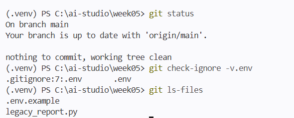

# Week05 과제 1 — 하드코딩 키 리팩터링

## ① 무엇이 위험했는지
- API 키와 DB 접속 문자열(비밀번호 포함)이 코드에 평문으로 하드코딩되어, 커밋하는 순간 git 히스토리와 GitHub에 영구히 남는다.
- 주석에 폐기되지 않은 옛 키가 남아 있었고, DEBUG 로그가 DB 비밀번호와 API 키 전체를 콘솔에 출력했다.

## ② 어떻게 고쳤는지
- 비밀 값을 `.env`로 분리하고 `python-dotenv`(`load_dotenv()` + `os.getenv()`)로 읽도록 수정했다.
- `.gitignore`에 `.env`를 추가해 커밋을 막고, 키 이름만 담은 `.env.example`을 공유용으로 커밋했다.
- 옛 키 주석과 비밀 값을 출력하던 DEBUG 로그 2줄을 삭제했다.

## ③ 실키가 1차 커밋으로 노출되었다면 (3.3절 5단계 — 올바른 대응)
줄을 지우고 다시 커밋하는 것은 잘못된 대응이다. 과거 커밋에 키가 그대로 남고, 이미 수집된 키는 지워도 무효화되지 않는다. 노출된 키는 지우는 것이 아니라 죽여야 한다.
1. 즉시 해당 키를 폐기(revoke)하고 새 키를 재발급받는다. 유일하게 확실한 해법이다. (DB 비밀번호도 변경)
2. 새 키는 `.env`로 격리하고 `.gitignore`를 정비한다.
3. 사용량·청구 내역을 점검하고, 필요하면 사업자에 신고한다.
4. 히스토리에 남은 옛 키는 이미 무효이므로 위협이 아니다. 저장소 정리가 필요하면 이력 재작성 도구(git filter-repo 등)를 쓴다.

## 검증 캡처 (.env 미추적 증명)

- 보안 체크리스트: [security_checklist.md](security_checklist.md)
- AI 사용 기록: [usage_log.md](usage_log.md)
